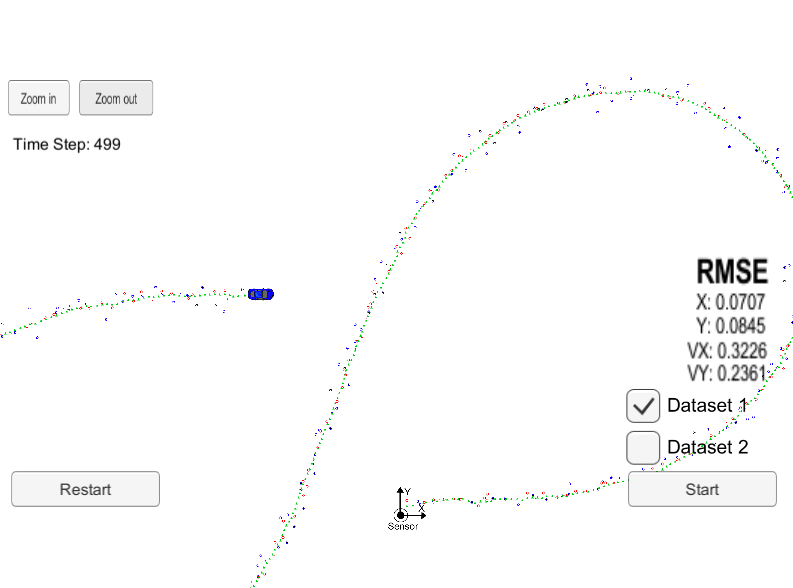
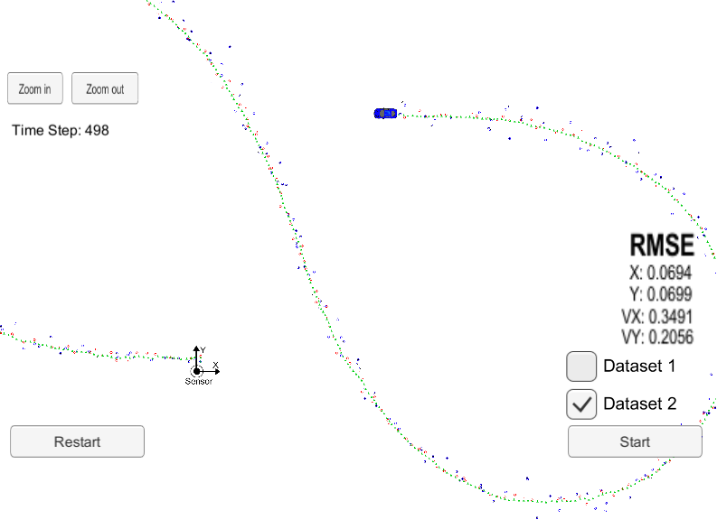
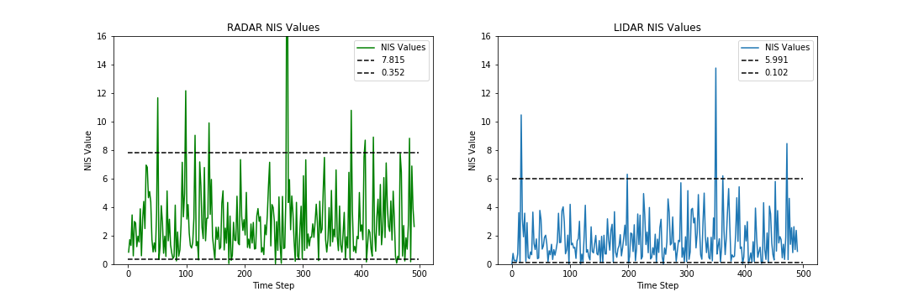
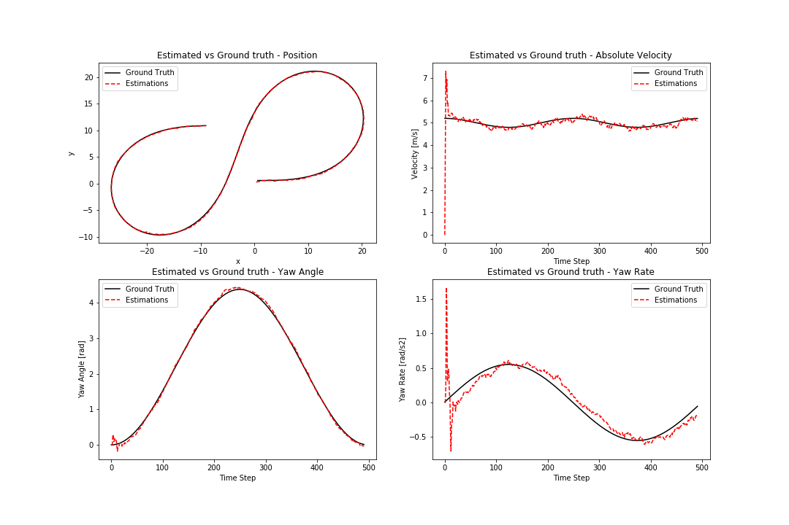

# Unscented Kalman Filter 

## 1. Introduction
This project implements an Unscented Kalman Filter in C++ to track an object around a stationary sensor using noisy LIDAR and RADAR data measurements passed via a simulator. This project was completed as part of Term 2 of Udacity's Self-Driving Car Nanodegree program.

## 2. Project Environment
The project was built using the Ubuntu 16-04 bash shell in Windows 10. Instructions to set this up can be found [here](https://www.howtogeek.com/249966/how-to-install-and-use-the-linux-bash-shell-on-windows-10/). The following dependencies need to be in place to build and execute the project.

* [Udacity SDC Term 2 Simulator](https://github.com/udacity/self-driving-car-sim/releases)
* cmake >= 3.5
* make >= 4.1 (Linux, Mac), 3.81 (Windows)
* gcc/g++ >= 5.4
* uWebSocketIO (installed via the [install-ubuntu.sh](https://github.com/shazraz/Extended-Kalman-Filter/blob/master/install-ubuntu.sh) script) 

The project consists of the following files located in the [src folder](https://github.com/shazraz/Unscented-Kalman-Filter/tree/master/src) folder:

* [main.cpp](https://github.com/shazraz/Unscented-Kalman-Filter/blob/master/src/main.cpp): Interfaces with the simulator using uWebSocketIO to recieve measurements and transmit estimates and RMSE values output by the UKF. Outputs the ground-truth values,  estimations and NIS values to an output file if specified during runtime.
* [ukf.cpp](https://github.com/shazraz/Unscented-Kalman-Filter/blob/master/src/ukf.cpp): Instantiates the UKF, initial object state (x), covariance (P) and calls the appropriate Prediction(), UpdateLidar() and UpdateRadar() methods for prediction, LIDAR updates & RADAR updates respectively.
* [tools.cpp](https://github.com/shazraz/Unscented-Kalman-Filter/blob/master/src/tools.cpp): Contains tools for calculating the RMSE values, angle normalizations and calculating NIS values.
* [Visualizations.ipynb](https://github.com/shazraz/Unscented-Kalman-Filter/blob/master/Visualizations.ipynb): Used to visualize the results of the UKF NIS values and estimations vs ground-truth values.

Once the environment is ready, the code can be tested as follows:

1. OPTIONAL: Modify initializations for x_ or P_ in ukf.cpp to test other values
2. OPTIONAL: Modify the standard deviations for longitudinal (std_a) and yaw accelaration (std_yaw_dd)
3. OPTIONAL: cd build
4. OPTIONAL: make
5. Launch the simulator and select the EKF/UKF project
6. ./UnscentedKF <optional output file>
7. Click Start in the simulator

The simulator shows a blue vehicle moving in a figure 8 around a stationary sensor. Green markers represent the state estimations determined by the UKF using the noisy RADAR (blue markers) and LIDAR (red markers) data. Two datasets are provided, Dataset 1 has the vehicle initially moving in the positive x direction and Dataset 2 has the vehicle initially moving in the negative x direction. Estimations, ground truth values and NIS values will be saved in the output file specified during runtime.

## 3. Results & Discussion
The UKF uses the CTRV (constant turn rate & velocity magnitude) motion model and estimates the following characteristics of object state, x: (px, py, v, psi, psi_dot) where p & v represent the position and velocity respectively, psi is the tracked object yaw angle and psi_dot is the tracked object's rate of change of yaw angle. The state is initalized with values x:(```meas1_px```, ```meas1_py```, 0, 0, 0) where meas1_px and meas1_py are set using the first measurement recieved. The covariance matrix, P, is initialized with a variance of (1,1,50,50,50) along the diagonals to reflect the uncertainty in the initial velocity, yaw and yaw rate but certainty in the initial position (which is obtained from the initial measurement).

Whereas the measurement noise standard deviation for both the RADAR and LIDAR sensors are provided, the process noise standard deviations for longitudinal and yaw acceleration (std_a, std_yawdd) are tuned to obtain good RMSE results. These values are determined by using the calculated NIS to ensure that over 90% of the values lie within the 5% and 95% thresholds for a chi-squared distribution. The values used for the thresholds correspond to values for systems with 2 degrees of freedom & 3 degrees of freedom for the LIDAR and RADAR respectively.

The following images show the results in the simulator for both datasets.

Dataset 1             |  Dataset 2 
:-------------------------:|:-------------------------:
  |    

The estimations, ground truth values and NIS values from the UKF are output into csv files located [here](https://github.com/shazraz/Unscented-Kalman-Filter/tree/master/output) for both datasets. The NIS values are visualized below for the selected std_a = 1 m/s^2 and std_yawdd = 0.3 rad/s^2:


The difference between the estimations and ground-truth values are visualized below:


As seen above, the UKF does an excellent job of estimating both the object position, velocity and more impressively, the yaw angle which is not measurement directly by either the RADAR or LIDAR.
